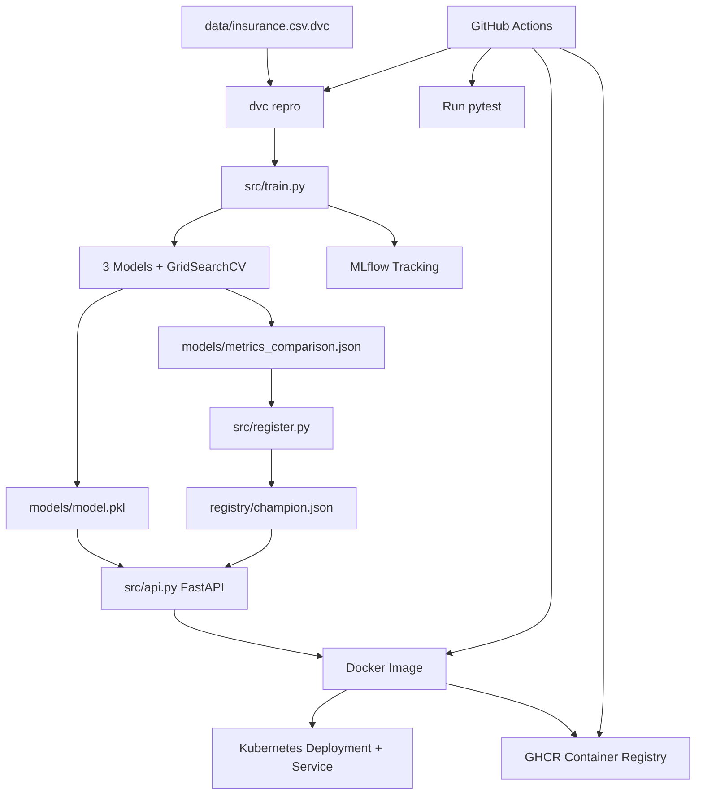

# Insurance MLOps Project - Updated Comprehensive Review

## 1) Executive Summary

This project now implements a complete assignment-aligned MLOps workflow for insurance charge prediction (regression), including:

- data/versioned pipeline orchestration with DVC,
- multi-model training and hyperparameter tuning,
- MLflow experiment tracking,
- champion model registration,
- FastAPI inference service,
- Docker packaging,
- Kubernetes deployment,
- GitHub Actions CI/CD automation.

Compared to the earlier version, this repository moved from a strong demo baseline to a much closer match to the formal group project rubric.

---

## 2) What Was Implemented in This Session

### A) DVC pipeline added

- Added `dvc.yaml` with stages for:
  - `train` -> `python -m src.train`
  - `register` -> `python -m src.register`
- Used existing dataset pointer `data/insurance.csv.dvc` to avoid overlapping output conflicts.
- Added DVC config:
  - `.dvc/config`
  - `.dvc/.gitignore`
- Generated `dvc.lock` through `dvc repro`.

### B) Multi-model training + tuning added

`src/train.py` was redesigned to train at least 3 models with `GridSearchCV`:

1. `RandomForestRegressor`
2. `DecisionTreeRegressor`
3. `AdaBoostRegressor`

For each candidate:

- train with preprocessing pipeline,
- tune hyperparameters,
- evaluate using `R2`, `MAE`, `RMSE`,
- log run/params/metrics/model to MLflow,
- persist candidate artifact.

Outputs now include:

- `models/candidates/<model>.pkl`
- `models/metrics_comparison.json` (ranked leaderboard)
- `models/metrics.json` (winner summary)
- `models/model.pkl` (best model for inference)

### C) Registry logic improved

`src/register.py` now:

- reads best candidate from `models/metrics_comparison.json`,
- promotes only on **strictly better** `R2`,
- writes richer `registry/champion.json` with:
  - model type/name,
  - winner metrics,
  - selected params,
  - model path and version timestamp.

### D) FastAPI inference API added

Added `src/api.py` with:

- `GET /health`
- `POST /predict`

Model loading uses the champion artifact (`models/model.pkl`) and validates input using Pydantic schema.

### E) Docker + runtime entrypoint updated

- `Dockerfile` moved runtime focus to FastAPI on port `8000`.
- Healthcheck switched to `http://localhost:8000/health`.
- `scripts/entrypoint.sh` now starts `uvicorn` (with optional New Relic wrapper).

### F) Kubernetes manifests updated

- `k8s/deployment.yaml`:
  - container port -> `8000`
  - probes -> `/health`
- `k8s/service.yaml`:
  - service/target/node ports updated to `8000`/`8000`/`30080`

### G) CI/CD workflow updated

`.github/workflows/ci-cd.yml` now runs:

1. dependency install
2. tests
3. `dvc repro` (full reproducible pipeline)
4. artifact upload
5. Docker image build/push to GHCR

### H) Security hygiene improved

- Replaced key-like values in:
  - `k8s/newrelic-secret.yaml`
  - `k8s/newrelic-secret.example.yaml`
- Both now use placeholder: `YOUR_NEW_RELIC_LICENSE_KEY`.

### I) Dev workflow and docs updated

- `Makefile` and `scripts/make.ps1` now include:
  - `register`
  - `dvc-repro`
  - `api`
- `README.md` rewritten to describe the new MLOps architecture and usage.
- `requirements.txt` extended for API + DVC ecosystem:
  - `fastapi`, `uvicorn`, `dvc`, `httpx`, pinned `pathspec`.

---

## 3) Key Debugging/Integration Notes (What Happened During Setup)

The following issues were encountered and resolved:

1. **DVC import compatibility error**
   - Error due to `pathspec` version conflict.
   - Resolved by pinning `pathspec==0.12.1`.

2. **DVC overlapping output**
   - Conflict between `data/insurance.csv.dvc` and a DVC stage output declaration.
   - Resolved by removing overlapping `prepare_data` output stage and relying on existing `.dvc` tracking.

3. **Git-tracked model artifacts blocking DVC**
   - `models/model.pkl` and `models/metrics.json` were tracked by Git.
   - Resolved by untracking from Git index (`git rm --cached`), then letting DVC own them as pipeline outputs.

4. **Pytest plugin interference**
   - Host environment autoloaded external plugins.
   - Resolved by running tests with `PYTEST_DISABLE_PLUGIN_AUTOLOAD=1`.

5. **Missing test dependency for FastAPI client**
   - `httpx` missing for `fastapi.testclient`.
   - Resolved by adding `httpx==0.27.2`.

---

## 4) Validation Results

### Pipeline run

- Command: `dvc repro`
- Result: successful stage execution for `train` and `register`
- Champion update observed: new winner registered from leaderboard.

### Test run

- Command: `PYTEST_DISABLE_PLUGIN_AUTOLOAD=1 pytest -q`
- Result: `5 passed`
- Added API test validates:
  - health endpoint
  - prediction endpoint behavior.

### Runtime checks

- API endpoint validated locally (`/health`, `/predict`).
- Streamlit app launched successfully; in WSL environments, browser connection may require using WSL IP when localhost forwarding is unreliable.

---

## 5) Current Architecture (After Changes)

1. Data tracked via DVC pointer (`data/insurance.csv.dvc`)
2. `dvc repro` executes training and registration
3. `src/train.py` tunes and compares 3 models
4. best model exported to `models/model.pkl`
5. `src/register.py` promotes winner to `registry/champion.json`
6. FastAPI serves prediction using champion model
7. Docker packages inference service
8. Kubernetes deploys container with health probes
9. GitHub Actions automates test + DVC repro + image build/push

---

## 6) Rubric Coverage Status

### Covered

- Non-trivial dataset and regression problem
- DVC usage for reproducible pipeline and data linkage
- 3 models trained
- hyperparameter tuning
- MLflow tracking for experiments
- champion selection/registry
- Dockerized inference service
- Kubernetes deployment/service
- CI/CD pipeline with automated training/evaluation/build steps
- documented workflow

### Still to finalize manually for submission

- generate the final 4-page PDF report
- collect screenshots/log evidence (DVC run, MLflow comparison, API response, k8s service, Actions green run)
- push all current local changes to remote branch.

---

## 7) Remaining Improvement Opportunities

1. Add register edge-case tests (no candidate, tie, missing files).
2. Add model signature/input example in MLflow logs.
3. Add CI container smoke test (`docker run` + `/health` check).
4. Add data/model checksum provenance to champion metadata.
5. Add report assets folder for reproducible submission evidence.

---

## 8) Final Assessment

This repository now demonstrates a strong, credible end-to-end MLOps implementation for coursework:

- reproducible pipeline orchestration,
- multi-model experimentation,
- tracked model selection,
- deployable API service,
- automated CI/CD.

It is now substantially aligned with the project requirements and ready for final packaging and submission.

---

## 9) System Architecture Diagram

### Diagram notes

- `dvc repro` is the reproducible orchestration entrypoint for training and champion registration.
- `src/train.py` handles model tuning/comparison and writes both leaderboard and winner artifacts.
- `src/register.py` promotes only improved models to `registry/champion.json`.
- FastAPI inference (`src/api.py`) loads the champion artifact path and serves prediction endpoints.
- CI/CD executes tests, reproduces pipeline, and publishes container images for deployment.

